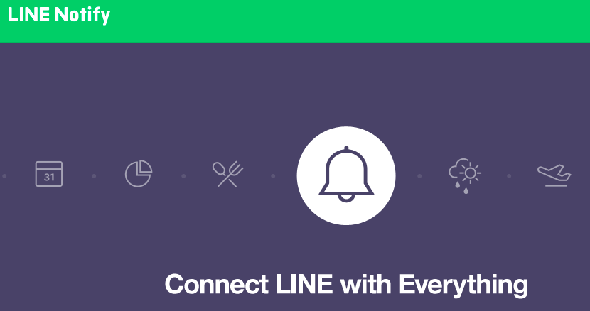
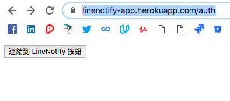
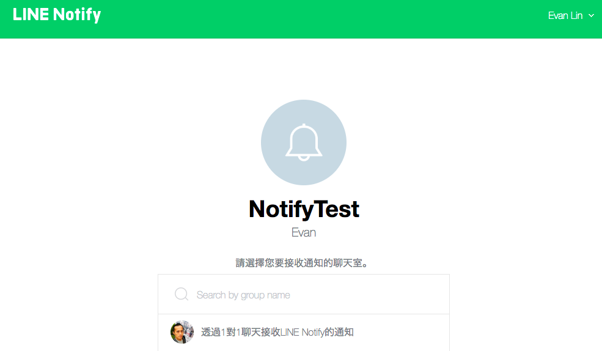
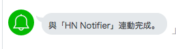
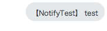
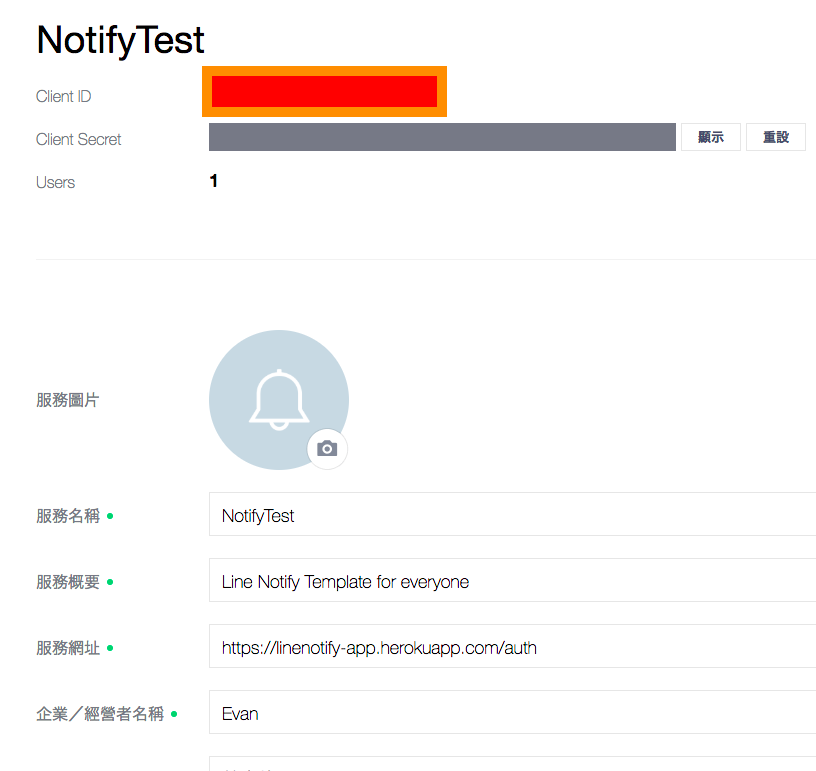
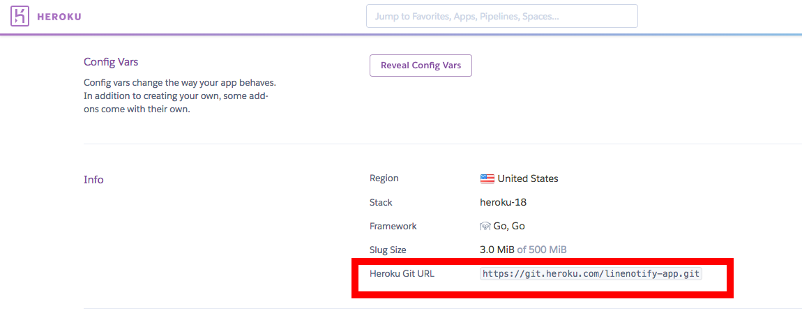

LineNotify template : A simple Golang Line Notify Bot template
==============

   

This is a template to help you if you want to implement [Line Notify](https://notify-bot.line.me/zh_TW/). It help us follow:

- Authenication with Line Notify server
- Help you to access token from Line Notify server
- A notify entry point to notify Line Notify server

You can just try it or fork this repo to developing your own Line Notify server in Go.

## Just want to try it?

- [Go to my test Line Notify site](https://linenotify-app.herokuapp.com/auth)

- Click this button and remember to login your Line account for authenication this notify.

- Select one on one notification, click "Agreed and Connected"
- It will help you to add friend with "Line Notify".

- Go to this link add arbitrary string after msg=xxxx ex: https://linenotify-app.herokuapp.com/notify?msg=test

  

## Installation for developer

### 1. Got A Line Bot API devloper account

[Register your Line Notify Account](https://notify-bot.line.me/my/services/new)

- You need to fill all related info you need.
- For "Service Site" and "Callback URL", just fill arbitrary web site with "http://xxx.xxx.com"
- Remember you need "Client ID" and "Client Secret" for Heroku setup.

### 2. Deploy to your Heroku account

Remember your heroku ID.

### 3. Config your Heroku Variables 

Please config three variables as follow:

- `CallbackURL`: Callback URL which should be `https://YOUR_HEROKU_APPID.herokuapp.com/callback`
- `ClientID`: Client ID from Line Notify page
- `ClientSecret`: Client Secret from Line Notify page

### 3. Fork this project and add git remote to heroku.

This is example of my heroku settup.

In your fork repo, path

- `git remote add heroku https://git.heroku.com/YOUR_ID.git`

### 4. Update your related code.

- Update `govendor` setting.
    - Install govendor
        - `go get -u github.com/kardianos/govendor`
    - Update root path
        - `rm -Rf vendor`
        - `govendor init`
### 5. Modify your code

### 6. Push to Heroku

- `git push -u heroku HEAD`

  

## Further Work:

If you want to implement business Line Notify service, you will need implement followsing after this repo.

- Implement a database service to store all users' `token` and `code`.
- Because Heroku server will `force to shudown 6 hours per day`, you will need to implement a dedicate server to notify Line Notify service once the notification happen anytime.

If you still have any questions, please file your issue and let me know.

## Reference

- [Line Notify Doc](https://notify-bot.line.me/doc/en/)
- [實作 Line Notify 通知服務 (1)](https://poychang.github.io/line-notify-1-basic/)
